# Chicago Crime Analysis Dashboard

An interactive, production-grade analytics web application built with **Streamlit**, **Pandas**, and **Plotly** to visualize and analyze historical crime patterns across Chicago.

This dashboard fulfills all ground rules, KPIs, and visualization specifications defined in the Chicago Crimes Analysis Competition Handout.

---

## 📌 Dashboard Overview

The application provides an executive-level single-page interface featuring:

* **8 Key Performance Indicators (K1–K8)** covering crime volume, arrest efficiency, and incident characteristics.
* **10 Analytical Visualizations (Q1–Q10)** highlighting temporal trends, crime categorizations, district rankings, and high-density risk matrices.
* **Interactive Slicing & Ground Rule Isolation** allowing multi-select filtering by primary crime type and police district while preserving baseline benchmarking views.
* **Assumption Logging** detailing time-of-day bins, statutory seasonal definitions, and category classifications.

---
## 🖼️ Visual Previews

<details>
<summary><b>Click to expand chart preview gallery</b></summary>
<br>

| Dashboard Overview/KPIs | Q1: Monthly Crime Count |
| :---: | :---: |
| 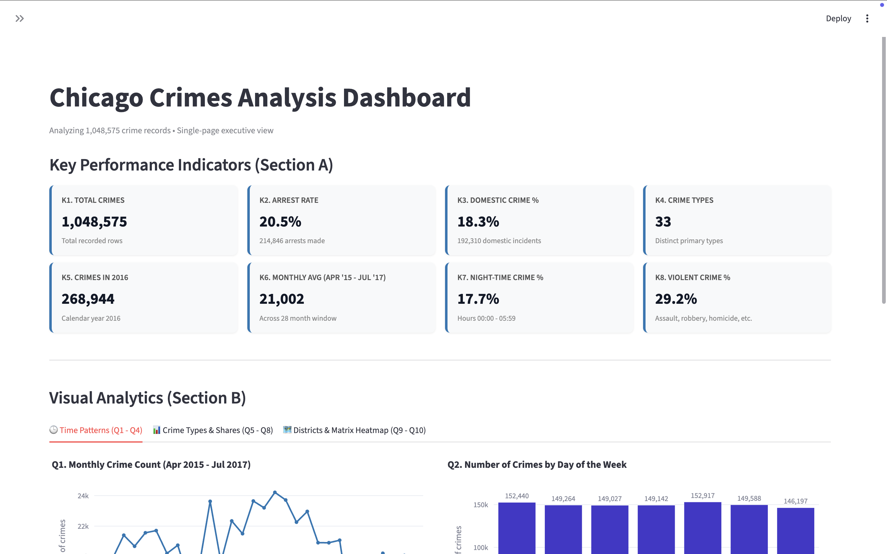 | 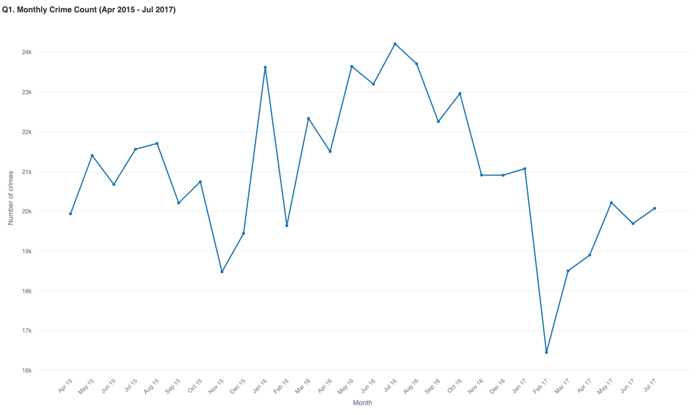 |

| Q2: Day of Week | Q3: Time of Day |
| :---: | :---: |
| 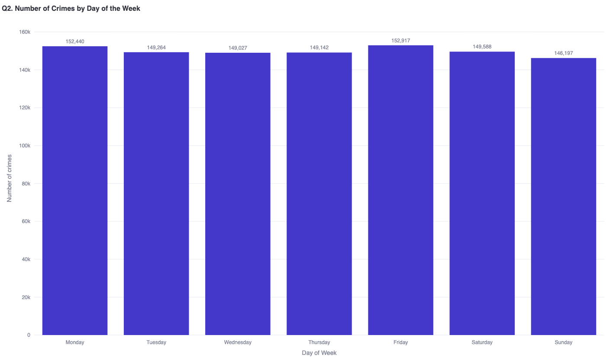 | 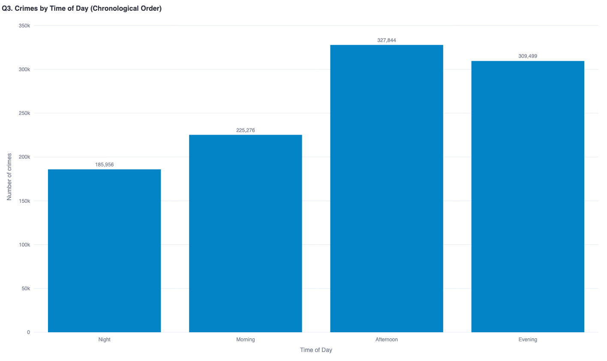 |

| Q4: Season (2016) | Q5: Crime Category Share |
| :---: | :---: |
| 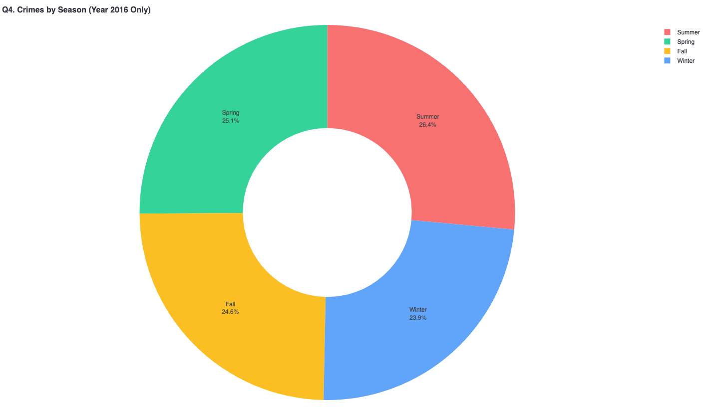 | 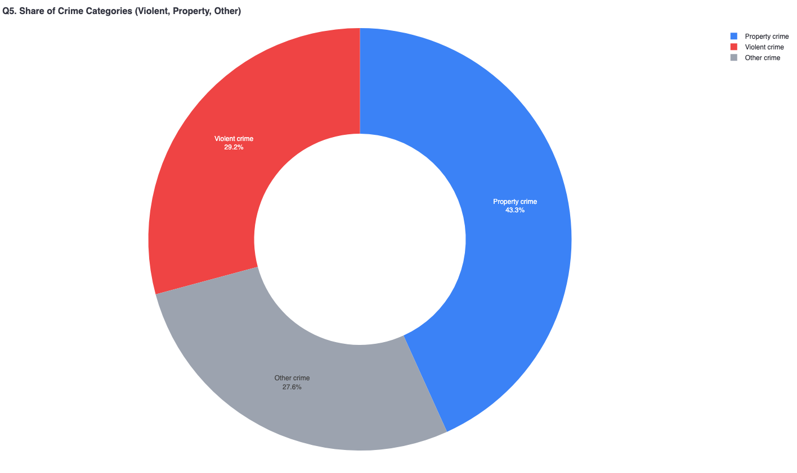 |

| Q6: Arrest Rate % by Time | Q7: Top 10 Crime Types |
| :---: | :---: |
| 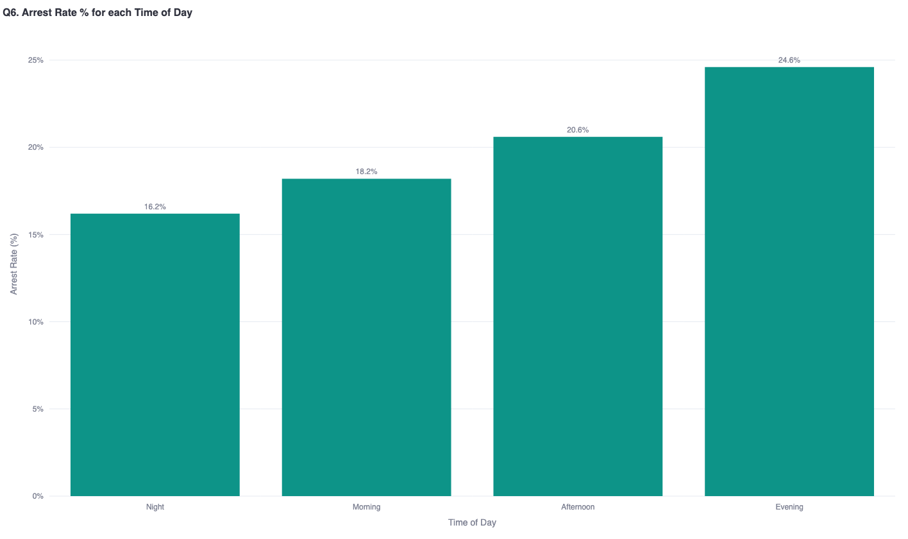 | 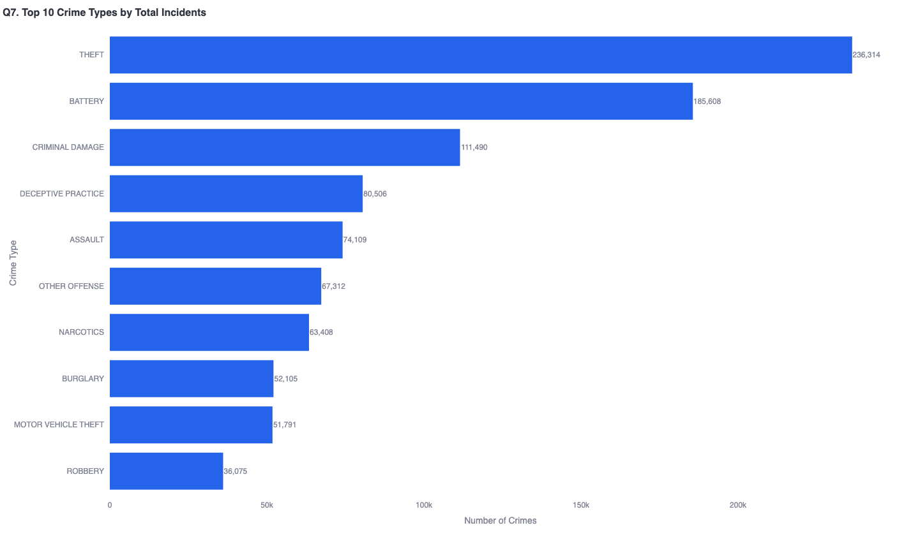 |

| Q8: Top 5 Domestic Crimes | Q9: Police Districts Combo |
| :---: | :---: |
| 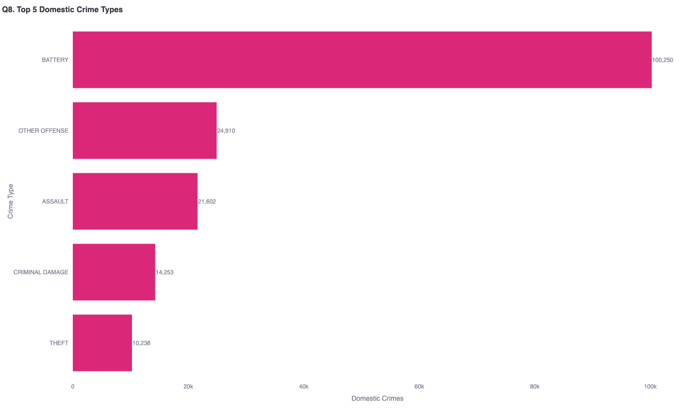 | 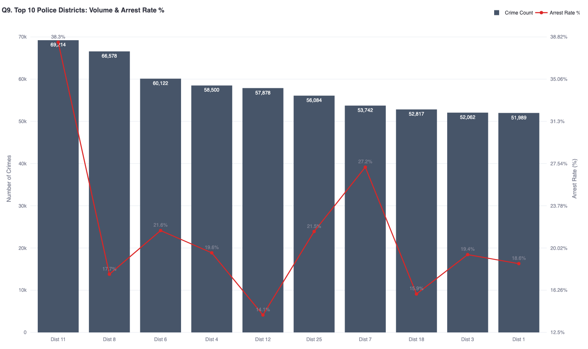 |

| Q10: Day vs Time Heatmap |
| :---: |
| 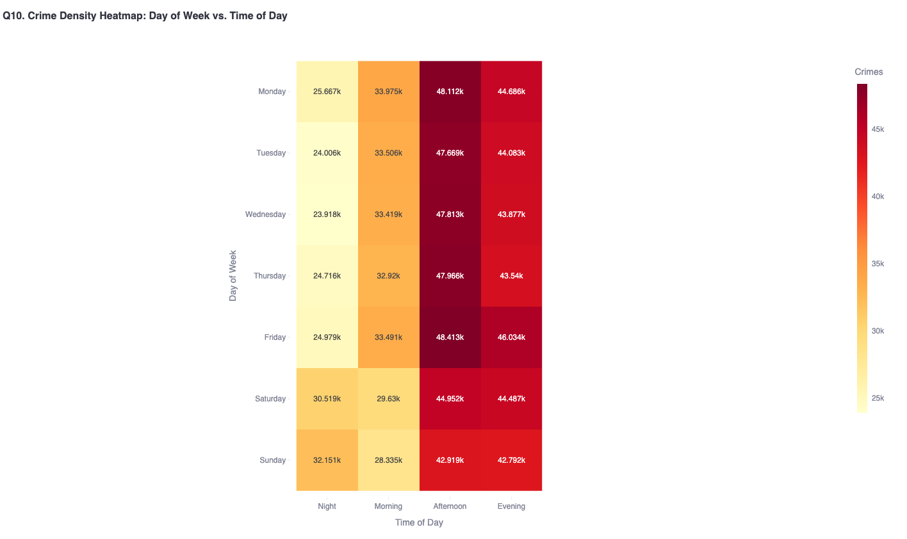 |

</details>

---

## 📊 Features & Handout Solutions

### Section A: KPI Metric Cards (K1 – K8)

* **K1. Total Crimes**: Total row count across the dataset.
* **K2. Arrest Rate %**: Total arrests divided by total crimes $\left(\frac{\text{Arrests}}{\text{Total Crimes}} \times 100\right)$, benchmarked against the worked example.
* **K3. Domestic Crime %**: Proportion of offenses flagged as domestic incidents.
* **K4. Unique Crime Types**: Count of distinct primary crime classifications.
* **K5. Crimes in 2016**: Incident volume isolated for the 2016 calendar year.
* **K6. Average Monthly Crimes**: Average monthly incident volume across the 28-month evaluation window (April 2015 to July 2017).
* **K7. Night-Time Crime %**: Percentage of crimes committed between 00:00 and 05:59.
* **K8. Violent Crime %**: Percentage of offenses classified under violent crimes.

---

### Section B: Visual Analytics (Q1 – Q10)

| Question | Chart Type | Description | Preview |
| --- | --- | --- | --- |
| **Q1** | Line Chart with Markers | Monthly crime volume trend from April 2015 to July 2017 (28 months) |  |
| **Q2** | Column / Bar Chart | Distribution across days of the week, sorted chronologically (Monday to Sunday) |  |
| **Q3** | Column / Bar Chart | Distribution across times of day, ordered chronologically (Night, Morning, Afternoon, Evening) |  |
| **Q4** | Donut Chart | Seasonal crime distribution isolated strictly to the year 2016 |  |
| **Q5** | Donut Chart | Proportion of offenses categorized as **Violent**, **Property**, or **Other** |  |
| **Q6** | Column / Bar Chart | Arrest rate percentage across each chronological time-of-day period |  |
| **Q7** | Horizontal Bar Chart | Top 10 primary crime types by total volume, sorted from highest to lowest |  |
| **Q8** | Horizontal Bar Chart | Top 5 primary crime types specifically for domestic incidents |  |
| **Q9** | Dual-Axis Combo Chart | Top 10 police districts by total crime volume (bars) and their arrest rate % (secondary line) |  |
| **Q10** | Heatmap Matrix | 7×4 cross-tabulation matrix of Day of Week vs. Time of Day with density labels |  |

---

## 📂 Repository Structure

```text
├── .gitattributes                                        # Git LFS configuration
├── Crime Dataset.xlsx                                    # Dataset binary (tracked via Git LFS)
├── README.md                                             # Project documentation
├── app.py                                                # Streamlit dashboard application
├── requirements.txt                                      # Python package dependencies
├── Dashboard.png                                         # Complete dashboard layout screenshot
├── q1-monthly-crime-count-apr-2015-jul-2017.png          # Visual export Q1
├── q2-number-of-crimes-by-day-of-the-week.png            # Visual export Q2
├── q3-crimes-by-time-of-day-chronological-o.png          # Visual export Q3
├── q4-crimes-by-season-year-2016-only.png                # Visual export Q4
├── q5-share-of-crime-categories-violent-pro.png          # Visual export Q5
├── q6-arrest-rate-for-each-time-of-day.png               # Visual export Q6
├── q7-top-10-crime-types-by-total-incidents.png          # Visual export Q7
├── q8-top-5-domestic-crime-types.png                     # Visual export Q8
├── q9-top-10-police-districts-volume-arrest.png          # Visual export Q9
└── q10-crime-density-heatmap-day-of-week-vs.png          # Visual export Q10

```

---

## 🗄️ Dataset & Git LFS Setup

The primary dataset (`Crime Dataset.xlsx`) is bundled directly in this repository and tracked using **Git Large File Storage (Git LFS)** via `.gitattributes`.

### 1. Install Git LFS

Before cloning, ensure Git LFS is installed on your local machine:

* **macOS (Homebrew):**
```bash
brew install git-lfs

```

* **Windows (Scoop / Chocolatey / Git for Windows):**
```powershell
choco install git-lfs
# or download installer from git-lfs.github.com

```

* **Ubuntu / Debian:**
```bash
sudo apt-get install git-lfs

```

Initialize Git LFS once on your system:

```bash
git lfs install

```

### 2. Clone the Repository

Cloning with Git LFS pulls the complete dataset binary rather than pointer stubs:

```bash
git clone https://github.com/<your-username>/Chicago-Crime-Analysis-Dashboard-rc.git
cd Chicago-Crime-Analysis-Dashboard-rc

```

> **Note:** If you already cloned the repository without Git LFS installed and see a small pointer file for `Crime Dataset.xlsx`, pull the actual dataset contents by running:
> ```bash
> git lfs pull
> 
> ```

---

## ⚙️ Installation & Local Setup

### 1. Create and Activate a Virtual Environment

**Windows (PowerShell / Command Prompt):**

```powershell
python -m venv venv
.\venv\Scripts\Activate.ps1

```

*(If PowerShell restricts script execution, run: `Set-ExecutionPolicy -Scope Process -ExecutionPolicy Bypass`)*

**macOS / Linux:**

```bash
python3 -m venv venv
source venv/bin/activate

```

### 2. Install Dependencies

Always invoke `python -m pip` to ensure packages are installed directly into your active virtual environment:

```bash
python -m pip install -r requirements.txt

```

### 3. Launch the Application

Run Streamlit through the virtual environment's Python interpreter:

```bash
python -m streamlit run app.py

```

The application will launch in your default web browser at `http://localhost:8501`.

---

## 📐 Handout Specifications & Mappings

### Key Performance Indicators (K1 – K8)

* **K1. Total Crimes**: Total row count across the dataset.
* **K2. Arrest Rate %**: $\frac{\text{Total Arrests}}{\text{Total Crimes}} \times 100$.
* **K3. Domestic Crime %**: Proportion of offenses identified with domestic flags.
* **K4. Unique Crime Types**: Count of distinct primary crime classifications.
* **K5. Crimes in 2016**: Incident volume isolated for the 2016 calendar year.
* **K6. Average Monthly Crimes**: Mean monthly volume during the 28-month evaluation window (April 2015 to July 2017).
* **K7. Night-Time Crime %**: Proportion of crimes committed between 00:00 and 05:59.
* **K8. Violent Crime %**: Percentage of offenses classified under violent crimes.

### Ground Rules & Business Logic

The dashboard adheres strictly to the competition ground rules:

1. **Time of Day Definitions**:
* **Night**: `00:00 – 05:59`
* **Morning**: `06:00 – 11:59`
* **Afternoon**: `12:00 – 17:59`
* **Evening**: `18:00 – 23:59`


2. **Season Classifications**:
* **Winter**: December, January, February
* **Spring**: March, April, May
* **Summer**: June, July, August
* **Fall**: September, October, November


3. **Crime Category Mappings**:
* **Violent Crime**: Assault, Battery, Robbery, Homicide, Criminal Sexual Assault, Kidnapping
* **Property Crime**: Theft, Burglary, Motor Vehicle Theft, Criminal Damage, Arson
* **Other Crime**: All remaining offense types


4. **Specific Time Windows**:
* **Q1 & K6**: Strictly calculated over the 28-month range from **April 2015 to July 2017**.
* **Q4 & K5**: Isolated strictly to calendar year **2016**.

---

## 🛠️ Built With

* [Streamlit](https://streamlit.io/) – Modern web framework for data applications.
* [Pandas](https://pandas.pydata.org/) – High-performance vectorized data manipulation.
* [Plotly](https://plotly.com/python/) – Interactive, publication-ready data visualizations.
* [OpenPyXL](https://openpyxl.readthedocs.io/) – Excel workbook parser.
